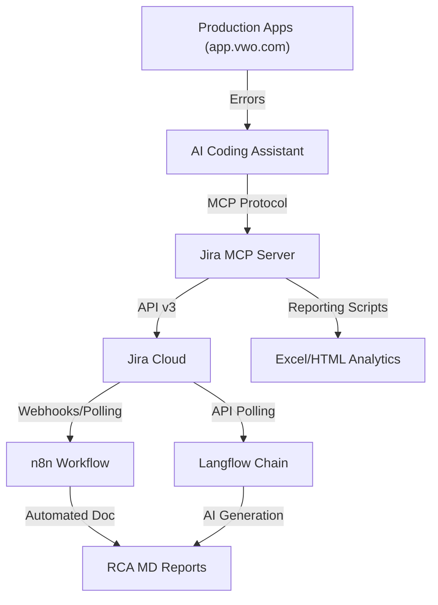

# Jira Bug Automation MCP Server (n8n & Langflow)

[](./images/architecture.png)

A high-performance **Model Context Protocol (MCP)** server for Jira that automates the entire quality lifecycle: from identifying production bugs to raising them in Jira, assigning them to specialized developers, and generating automated **Root Cause Analysis (RCA)** reports using `n8n` and `Langflow`.

---

## 🚀 Key Features

*   **Jira-to-AI Bridge**: Full Jira Cloud manipulation via MCP tools (`get_issue`, `create_issue`, `search_issues`).
*   **Automated Bug Raising**: Specialized scripts to identify 400/500 errors in production (UI & API) and raise tickets instantly.
*   **Developer Assignment Engine**: Auto-assigns tickets to Frontend, Backend, or Full Stack developers based on bug metadata.
*   **n8n RCA Automation**: A continuous monitoring flow that triggers on tickets with the "RCA" keyword to build detailed RCA docs locally.
*   **Langflow Integration**: Graph-based AI chains for generating RCA descriptions following industry-standard rules.
*   **Advanced Analytics**:
    *   **Excel Export**: One-click `.xlsx` and `.csv` exports for bug tracking.
    *   **Stakeholder HTML Report**: Premium, visual stakeholder dashboard for quality audit.

---

## 🏗️ Architecture



---

## 🛠️ How to Run

### 1. Prerequisites
- **Node.js** v18+ 

### 2. Configuration
Copy the `.env.example` file to `.env` and fill in your Jira credentials:
```bash
cp .env.example .env
```
Ensure you have:
*   `JIRA_URL`: Your Jira instance (e.g., `https://domain.atlassian.net`)
*   `JIRA_API_TOKEN`: Created via Atlassian account security.
*   `JIRA_EMAIL`: Your Atlassian account email.

### 3. Installation
```bash
npm install
```

### 4. Running the Project
*   **Start the MCP Server**:
    ```bash
    npm start
    ```
*   **Sync Local Bugs to Jira**:
    ```bash
    node push_to_jira.js
    ```
*   **Export Jira Data to Excel/CSV**:
    ```bash
    node export_all_jira_bugs.js
    ```
*   **Generate Stakeholder Dashboard**:
    ```bash
    node generate_reports.js
    ```

---

## 📁 File Manifest

*   `index.js`: Main MCP server implementation.
*   `push_prod_bugs.js`: Script to raise production tickets with the RCA keyword.
*   `n8n-rca-generator-for-rca-bugs.json`: Ready-to-import n8n workflow.
*   `langflow-capture-rca-bugs-alongwith-rca-details.json`: Langflow graph configuration.
*   `developers.json`: Team roster for auto-assignment.
*   `bugs.json`: Structured local repository of identified errors.

---

## 📄 License
MIT License. Created and maintained for PD Advanced Quality Assurance.
